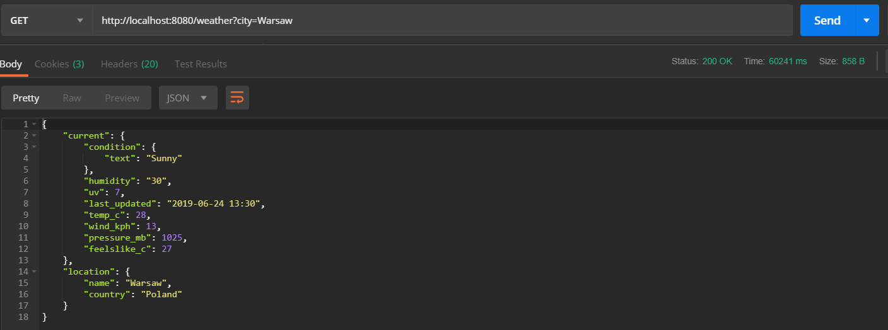
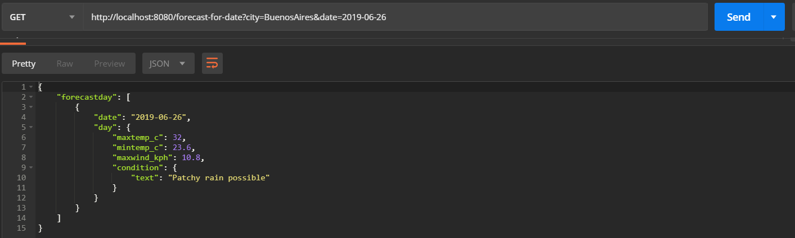
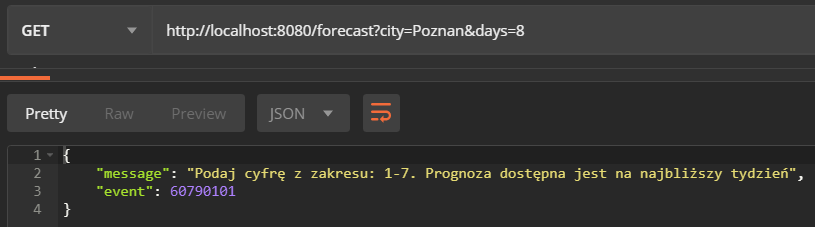

# Weather Rest Api
> WeatherRestApi is a weather api. It allows you to check the current weather and weather forecasts around the world.

## Table of contents
* [General info](#general-info)
* [Technologies](#technologies)
* [Features](#features)
* [Available country codes](#available-country-codes)
* [Status](#status)

## General info
WeatherRestApi connects to two external api and extends their functionality. There are main functions of the application and examples from Postman:
- checking the current weather forecast from a given country: 

 
 
 
- checking the weather forecast for a specific city for a specific number of days (it is possible to check the forecast 7 days ahead):

 
 
 
- checking current ppogoda for two cities at the same time:

 
 
 
- checking the current weather for all cities in a given country:

 
 
 
- checking the weather forecast for a specific city and a specific day:

 
 

Access to the application was secured with the help of Keycloak and OAuth2. The user must have a generated token to download the data:

 
 
 
Application is protected against inappropriate requests through exception handling. Here are examples:

 

 

## Technologies
* Java 7
* Maven  version 4.0
* SpringBoot version 2.1.3
* Checkstyle version 8.18
* Swagger version 2.9.2
* Lombok version 1.8.16
* JUnit version 4.12
* Keycloak version 6.0.1

## Available country codes:
    DE, DO, FR, IT, BD, BE, CA, ES, GB, GF, GP, MQ, PL, RE, RW, SE, TW, UG, AR, AS, AT, BI, CH, CI, CL, CO,
    CR, EC, EE, FI, GR, JP, MM, NG, NL, PA, PE, PH, PT, PY, RO, TL, TZ, US, ZA, AF, AL, AU, AX, AZ, BF, BR,
    BW, CF, DK, FO, GN, HT, IE, IN, IQ, IS, JM, KR, LC, LU, LV, MW, MX, NO, NP, NZ, OM, PR, RS, SJ, TF, TH,
    UY, VI, YE, AD, AE, AG, AI, AM, AO, AQ, BA, BB, BG, BH, BJ, BM, BN, BO, BQ, BS, BT, BY, BZ, CD, CG, CK,
    CM, CN, CU, CV, CY, CZ, DJ, DM, DZ, EG, EH, ER, ET, FJ, FM, GA, GD, GE, GH, GM, GQ, GT, GU, GW, GY, HK,
    HN, HR, HU, ID, IL, IO, IR, JO, KE, KG, KH, KI, KM, KN, KP, KW, KZ, LA, LB, LI, LK, LR, LS, LT, LY, MA,
    MC, MD, ME, MG, MH, MK, ML, MN, MP, MR, MS, MT, MU, MV, MY, MZ, NA, NC, NE, NI, NR, PF, PG, PK, PM, PN,
    PS, PW, QA, RU, SA, SB, SC, SD, SG, SH, SI, SK, SL, SM, SN, SO, SR, ST, SV, SY, SZ, TD, TG, TJ, TM, TN,
    TO, TR, TT, TV, UA, UM, UZ, VC, VE, VN, VU, WF, WS, YT, ZM, ZW

## Status
Project is: _finished_
